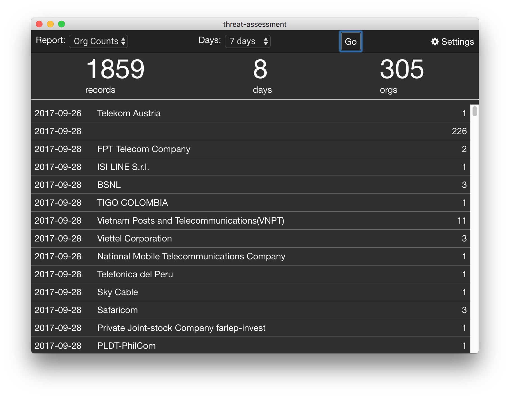

# ThreatStream-API-App
a client to use the Anomali Threatstream API, present and manipulate the results.

# Build Prerequisites
1. install npm

# Build
1. npm install (or npm update)
1. test it with: electron-forge start
1. build with: electron-forge make 
1. repeat the above steps on each platform required (windows, linux, mac)

# Editing Notes
- the records from the API result are put into alasql: http://alasql.org/
